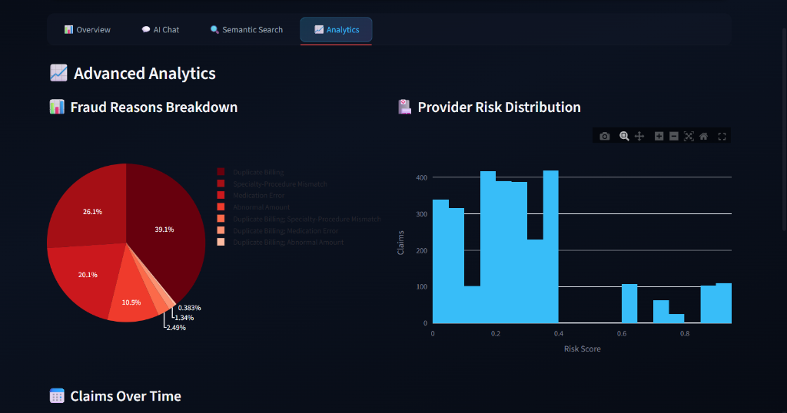
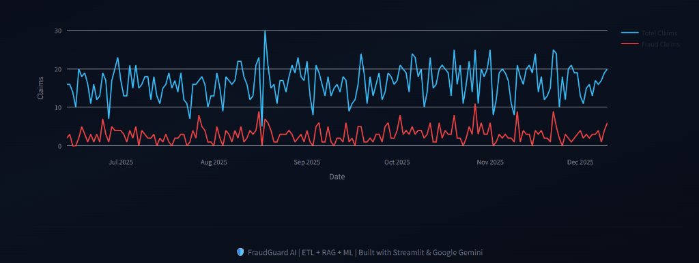

<div align="center">

# 🛡️ FraudGuard AI
### Intelligent Healthcare Fraud Detection
#### Powered by Generative AI, RAG, and Machine Learning

<!-- Dynamic GitHub Badges -->
[](https://github.com/Saurav12-7/Fraud-Detection/stargazers)
[](https://github.com/Saurav12-7/Fraud-Detection/network/members)
[](https://github.com/Saurav12-7/Fraud-Detection/issues)
[](https://github.com/Saurav12-7/Fraud-Detection/commits/main)
[](LICENSE)

<br>

<p align="center">
  
</p>

### Transform raw claims data into actionable intelligence.

[View Demo](#-interface) • [Report Bug](https://github.com/Saurav12-7/Fraud-Detection/issues) • [Request Feature](https://github.com/Saurav12-7/Fraud-Detection/issues)

</div>

---

## 📋 Table of Contents

- [Overview](#-overview)
- [Key Features](#-key-features)
- [Tech Stack](#-%EF%B8%8F-tech-stack)
- [Interface](#-interface)
- [Getting Started](#-getting-started)
- [Usage](#-usage)
- [Contributing](#-contributing)
- [Acknowledgements](#-acknowledgements)

---

## 📖 Overview

**FraudGuard AI** is a state-of-the-art fraud detection system designed for the healthcare industry. By combining traditional **Rule-Based Logic** with advanced **Machine Learning** and **Retrieval-Augmented Generation (RAG)**, it offers a comprehensive shield against billing anomalies.

Unlike standard detectors, FraudGuard understands *context*. It allows investigators to chat with their data using natural language and find semantic similarities across thousands of historical claims.

---

## 🚀 Key Features

| Feature | Description |
| :--- | :--- |
| **🕵️‍♂️ Hybrid Detection** | Dual-layer analysis using rule-based algorithms and ML models (Isolation Forest/Random Forest). |
| **💬 AI Investigator** | Chat with your data! Ask questions like *"Show me suspicious cardiology claims"* using **Google Gemini**. |
| **🧠 Semantic Search** | RAG-powered search to find fraud patterns by meaning, not just keywords (e.g., *"upcoding patterns"*). |
| **📊 Interactive Analytics** | **Dynamic, data-driven** dashboards that visualize fraud drivers, provider risk distribution, and temporal trends in real-time. |
| **🔄 Auto-ETL** | Seamless pipeline to process raw `claims.csv` & `providers.csv` into analysis-ready datasets. |

---

## 🛠️ Tech Stack

<div align="center">

| Component | Technology |
| :---: | :--- |
| **Frontend** |  |
| **LLM & Agents** |   |
| **Machine Learning** |  |
| **Vector Search** |  |
| **Data Processing** |   |

</div>

---

## 📸 Interface

> Experience a modern, dark-themed UI designed for clarity and speed.

| **Advanced Analytics** | **Claims Timeline** |
| :---: | :---: |
|  |  |

---

## 🚚 Getting Started

### Prerequisites

*   **Python 3.8+**
*   **Google Gemini API Key** (Get one [here](https://aistudio.google.com/))

### Installation

1.  **Clone the Repository**
    ```bash
    git clone https://github.com/Saurav12-7/Fraud-Detection.git
    cd Fraud-Detection
    ```

2.  **Install Dependencies**
    ```bash
    pip install -r requirements.txt
    ```

3.  **Run the Application**
    ```bash
    streamlit run Frontend/interface_ultimate.py
    ```

4.  **Access the Dashboard**
    Open your browser to `http://localhost:8501`.

---

## 🎯 Usage Guide

### 1. 🔑 Authentication
Enter your **Google Gemini API Key** in the sidebar. This unlocks the AI Chat and Semantic Search capabilities.

### 2. 📊 Dashboard & Advanced Analytics
- **Live Metrics**: Monitor total claims volume, current fraud rates, and financial exposure in real-time.
- **Dynamic Capabilities**:
    - **Fraud Drivers**: Breakdown of *why* claims are flagged (e.g., "Duplicate Billing", "Upcoding").
    - **Risk Segmentation**: interactive histogram showing the distribution of provider risk scores.
    - **Trend Analysis**: Time-series visualization tracking fraud velocity and claim volume over time.

### 3. 💬 AI Interaction
- Go to the **AI Chat** tab.
- Type prompts like:
    > "Identify the top 5 providers with the highest risk scores."
    > "Plot the trend of fraud cases over the last 30 days."

### 4. 🔍 Semantic Investigation
- Navigate to **Semantic Search**.
- Search for concepts rather than exact matches:
    > "Duplicate billing for same patient on same day"

---

## 🤝 Contributing

Contributions are what make the open source community such an amazing place to learn, inspire, and create. Any contributions you make are **greatly appreciated**.

1.  Fork the Project
2.  Create your Feature Branch (`git checkout -b feature/AmazingFeature`)
3.  Commit your Changes (`git commit -m 'Add some AmazingFeature'`)
4.  Push to the Branch (`git push origin feature/AmazingFeature`)
5.  Open a Pull Request

---

## 👨‍💻 Developer

<div align="center">

**Kumar Saurav**

[](https://github.com/Saurav12-7)
[](https://www.linkedin.com/in/kumar-saurav-6551211a3/)

</div>

---

<div align="center">
  <sub>Built with ❤️ using Python and Streamlit.</sub>
</div>
